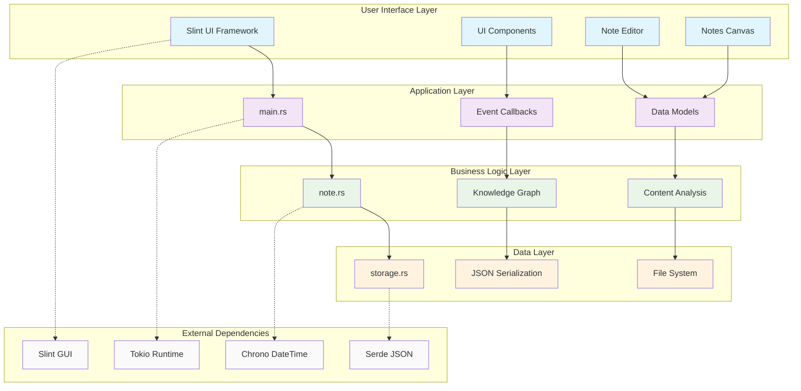

# Smart Sticky Notes

An intelligent cross-platform sticky notes application built with Rust and Slint GUI framework. Features knowledge graph visualization, workflow automation, and AI-powered content analysis for modern note-taking and knowledge management.


## Architecture Overview



## Features

### Core Features
- 📝 **Create and Edit Notes**: Intuitive interface with advanced note editor
- 🎨 **Smart Color Selection**: Auto-contrast text color and customizable backgrounds
- 🖱️ **Drag & Drop**: Freely move notes around the canvas
- 💾 **Persistent Storage**: Automatic saving with atomic file operations
- 🔍 **Real-time Search**: Filter notes by title, content, or tags
- 🏷️ **Tag System**: Organize notes with custom tags
- ⚡ **Quick Add**: Instantly create notes with keyboard shortcuts

### Advanced Features
- 🧠 **Knowledge Graph**: Visualize relationships between notes
- 🔗 **Auto-Discovery**: AI-powered relationship detection
- 📊 **Workflow Management**: Track progress with status indicators (Idea → Todo → In Progress → Review → Done)
- 🎯 **Priority System**: Organize notes by urgency (Low, Medium, High, Urgent)
- 📈 **Sentiment Analysis**: Automatic content mood detection
- 🔤 **Keyword Extraction**: AI-powered content analysis
- 📅 **Due Dates**: Time management with deadline tracking
- ⏱️ **Time Estimation**: Track estimated vs actual time spent

### Technical Features
- 🖥️ **Cross-Platform**: Native support for Windows, macOS, and Linux
- ⚡ **Native Performance**: Built with Rust for optimal speed and memory usage
- 📱 **Responsive Design**: Adaptive layout for different screen sizes
- 🎯 **Lightweight**: Minimal resource consumption
- 🔄 **Real-time Updates**: Instant UI synchronization

## Technology Stack

### Core Technologies
- **Language**: Rust 1.70+ with modern async/await patterns
- **GUI Framework**: [Slint](https://slint.dev/) - Declarative UI toolkit with native performance
- **Runtime**: Tokio for async operations and cross-platform compatibility

### Data & Storage
- **Storage Format**: JSON with atomic file operations
- **Serialization**: Serde ecosystem for robust data handling
- **File System**: Platform-specific data directories with proper permissions
- **Backup**: Incremental backup system with version control

### AI & Analytics
- **Content Analysis**: Custom algorithms for keyword extraction
- **Sentiment Analysis**: Rule-based emotion detection
- **Knowledge Graph**: Graph-based relationship discovery
- **Auto-categorization**: Smart tagging based on content patterns

### Development Tools
- **Build System**: Cargo with custom build scripts
- **Testing**: Integration tests with async support
- **Documentation**: Inline docs with examples
- **CI/CD**: Platform-specific build automation

## Installation

### Prerequisites

- Rust 1.70 or later
- Git

### Building from Source

1. Clone the repository:
```bash
git clone https://github.com/yourusername/rust_slint_sticky.git
cd rust_slint_sticky
```

2. Build the application:
```bash
cargo build --release
```

3. Run the application:
```bash
cargo run --release
```

### Development

For development with hot-reload capabilities:

```bash
cargo run
```

## Usage

### Creating Notes

1. Click the "Add New Note" button in the header
2. Enter a title and content for your note
3. Choose a color from the available palette
4. Click "Save Note" to create the note

### Editing Notes

1. Click on any existing note to edit it
2. Modify the title, content, or color as needed
3. Click "Save Note" to update the note

### Deleting Notes

1. Click the "×" button in the top-right corner of any note
2. The note will be permanently deleted

### Data Storage

Notes are automatically saved to:
- **Windows**: `%APPDATA%\rust_slint_sticky\notes.json`
- **macOS**: `~/Library/Application Support/rust_slint_sticky/notes.json`
- **Linux**: `~/.local/share/rust_slint_sticky/notes.json`

## Project Structure

```
smart_sticky_notes/
├── 📁 src/                          # Rust source code
│   ├── 📄 main.rs                   # Application entry point and UI logic (602 lines)
│   │                                # - Event handlers and callbacks
│   │                                # - UI data model management
│   │                                # - Application lifecycle
│   ├── 📄 note.rs                   # Core note data structures (335 lines)
│   │                                # - AppNote struct with extended fields
│   │                                # - WorkflowStatus and Priority enums
│   │                                # - Knowledge graph relationships
│   │                                # - Content analysis (keywords, sentiment)
│   ├── 📄 storage.rs                # Data persistence layer (221 lines)
│   │                                # - Async file operations
│   │                                # - JSON serialization/deserialization
│   │                                # - Cross-platform storage paths
│   │                                # - Backup and export functionality
│   └── 📄 lib.rs                    # Library configuration (65 lines)
│                                    # - Public API exports
│                                    # - Module declarations
├── 📁 ui/                           # User interface definitions
│   └── 📄 app.slint                 # Slint UI markup (878 lines)
│                                    # - Component definitions
│                                    # - Layout and styling
│                                    # - Event handling
│                                    # - Responsive design
├── 📁 tests/                        # Test suite
│   ├── 📄 integration_tests.rs      # Integration tests (95 lines)
│   │                                # - End-to-end functionality tests
│   │                                # - Storage layer testing
│   └── 📄 test_ui_interactions.md   # UI testing documentation (72 lines)
│                                    # - Manual testing procedures
│                                    # - UI interaction scenarios
├── 📁 scripts/                      # Development tools
│   └── 📄 dev.sh                    # Development helper script (141 lines)
│                                    # - Build and run commands
│                                    # - Testing utilities
│                                    # - Platform-specific builds
├── 📄 build.rs                      # Build configuration (3 lines)
│                                    # - Slint compilation setup
├── 📄 Cargo.toml                    # Rust project configuration (19 lines)
│                                    # - Dependencies management
│                                    # - Project metadata
├── 📄 Cargo.lock                    # Dependency lock file (5842 lines)
├── 📄 icon.svg                      # Application icon (18 lines)
├── 📄 TODO.md                       # Development roadmap (132 lines)
├── 📄 LICENSE                       # MIT license (21 lines)
├── 📄 .gitignore                    # Git ignore rules (55 lines)
└── 📄 README.md                     # Project documentation (this file)
```

### Module Responsibilities

#### Core Modules
- **`main.rs`**: Application orchestration and UI binding
  - Event handling and callback management
  - Data model synchronization
  - Application state management
  
- **`note.rs`**: Business logic and data structures
  - Note data model with extended metadata
  - Knowledge graph implementation
  - Content analysis algorithms
  - Workflow and priority management
  
- **`storage.rs`**: Persistence and data management
  - Async file I/O operations
  - JSON serialization with Serde
  - Cross-platform storage handling
  - Data backup and recovery

#### UI Layer
- **`app.slint`**: Declarative UI definition
  - Component hierarchy and layout
  - Styling and theming
  - User interaction handling
  - Responsive design implementation

#### Supporting Files
- **`build.rs`**: Compile-time code generation for Slint
- **`dev.sh`**: Development workflow automation
- **Tests**: Comprehensive testing suite for reliability

## Configuration

The application uses sensible defaults but can be customized:

- **Note Colors**: Predefined color palette (Yellow, Orange, Green, Blue, Pink)
- **Default Note Size**: 220×200 pixels
- **Storage Location**: Platform-specific data directories

## Development

### Code Structure

- **UI Layer**: Defined in `ui/app.slint` using Slint's declarative syntax
- **Business Logic**: Rust code in `src/` handles data management and UI callbacks
- **Storage Layer**: Async file operations with atomic writes for data safety

### Adding Features

1. **UI Changes**: Modify `ui/app.slint` for visual components
2. **Business Logic**: Update Rust modules in `src/`
3. **Data Model**: Extend the `StickyNote` struct if needed

### Building for Different Platforms

#### Windows
```bash
cargo build --release --target x86_64-pc-windows-gnu
```

#### macOS
```bash
cargo build --release --target x86_64-apple-darwin
```

#### Linux
```bash
cargo build --release --target x86_64-unknown-linux-gnu
```

## Roadmap

- [ ] **Drag & Drop**: Move notes around the interface
- [ ] **Search Functionality**: Find notes by content or title
- [ ] **Categories/Tags**: Organize notes with labels
- [ ] **Export/Import**: Backup and restore notes
- [ ] **Themes**: Dark mode and custom themes
- [ ] **Collaboration**: Real-time syncing across devices
- [ ] **Mobile Support**: iOS and Android apps

## Contributing

Contributions are welcome! Please feel free to submit a Pull Request. For major changes, please open an issue first to discuss what you would like to change.

### Development Setup

1. Fork the repository
2. Create a feature branch (`git checkout -b feature/amazing-feature`)
3. Commit your changes (`git commit -m 'Add amazing feature'`)
4. Push to the branch (`git push origin feature/amazing-feature`)
5. Open a Pull Request

### Code Style

- Follow Rust's official style guidelines
- Use `cargo fmt` for formatting
- Ensure `cargo clippy` passes without warnings
- Add tests for new functionality

## Testing

Run the test suite:

```bash
cargo test
```

Run with coverage:

```bash
cargo test --coverage
```

## License

This project is licensed under the MIT License - see the [LICENSE](LICENSE) file for details.

## Acknowledgments

- [Slint Team](https://slint.dev/) for the excellent GUI framework
- [Original Sticky Project](https://github.com/williamhatch/sticky) for inspiration
- The Rust community for amazing tools and libraries

## Support

If you encounter any issues or have questions:

1. Check the [Issues](https://github.com/yourusername/rust_slint_sticky/issues) page
2. Create a new issue if your problem isn't already reported
3. Provide detailed information about your environment and the issue

---

**Enjoy organizing your thoughts with Rust Slint Sticky Notes!** 📝✨ 